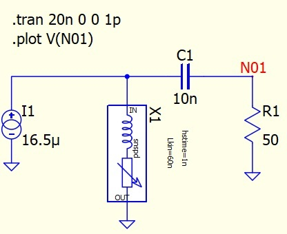

# QSpice SNSPD Model


This is a QSpice block model for SNSPD simulation. Using the C++ blocks provided by QSpice we managed to couple a heat equation simulation to the SPICE electrical simulation and thus are able to fully simulatie the elctro-thermal model of an SNSPD following equation:

```math
J^2\rho + \kappa\frac{\partial^2 T}{\partial x^2} - \frac{\alpha}{d}(T-T_{sub}) = c\frac{\partial T}{\partial t}
```

For more technical information see: [Modeling the Electrical and Thermal Response of Superconducting Nanowire Single-Photon Detectors](https://ieeexplore.ieee.org/document/4277823)


## Getting started

### Install
Install latest version of QSpice from https://www.qorvo.com/design-hub/design-tools/interactive/qspice

### Compiling the Model
- You need VS C++ build tools
- Run "cl /LD /std:c++17 snspd_x1.cpp kernel32.lib" in development terminal

### Run Basic example
- Open one of the examples from the examples folder.
- Dont forget to add the model folder to the Symbols & IP view by "right click -> Add Symbol Directory"
- Run simulation


## Variables
Some parameters of the SNSPD simulation can be changed to your liking:


### Physical
| Parameter   | Description | Default |
| :---------- | :--------- | ------: |
| width | Width of SNSPD | 100 nm |
| length | Length of SNSPD | 1.5 $\mu m$|
| thickness | Thickness of SNSPD | 4 nm|

### Electrical
| Parameter   | Description | Default |
| :---------- | :--------- | ------: |
| Lkin| Kinetic Inductance of SNSPD | 600 nH |
| Rsheet| Sheet Resistance of SNSPD | 600 $\Omega$|
| Ic0k| Critical Current at 0K | 20 $\mu A$|

### Thermal
| Parameter   | Description | Default |
| :---------- | :--------- | ------: |
| Tsub | Substrate Temperature | 2 K |
| Tc | Critical Temperature SNSPD | 10 K|
| alpha_Tc| Thermal boundary conductance at Tc| 8e5 W/m^2K|


