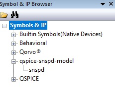

# QSpice SNSPD Model


This is a QSpice block model for SNSPD simulation. Using the C++ blocks provided by QSpice we managed to couple a heat equation simulation to the SPICE electrical simulation and thus are able to fully simulatie the elctro-thermal model of an SNSPD following equation:

```math
J^2\rho + \kappa\frac{\partial^2 T}{\partial x^2} - \frac{\alpha}{d}(T-T_{sub}) = c\frac{\partial T}{\partial t}
```

For more technical information see: [Modeling the Electrical and Thermal Response of Superconducting Nanowire Single-Photon Detectors](https://ieeexplore.ieee.org/document/4277823)


## Getting started

### Requirements
1. [QSpice](https://www.qorvo.com/design-hub/design-tools/interactive/qspice)
2. Unpacked pre-compiled release in a folder somewhere on your PC: [Releases](https://github.com/single-quantum/qspice-snspd-model/releases/)
3. OR Unpack this project somewhere on your PC and compile the project manually. [See how to compile](#how-to-compile)

### Add model to QSpice
1. Open QSpice
2. In the Symbol & IP browser right-click.
3. Click "Add a Symbol Directory"
4. Select the path to the project folder.
5. It should look like this and you should be able to drag an drop the snspd moldule in you project.




### Running examples
You can now run the examples form the examples folder. For a simple snspd read out circuit, open the basic.qsch example.

### Simulation recommendations
Since this simulation is stiff, too big of a time step can make the simulation very unstable. We therefore we recommend a maximum timestep of 1ps. Another option in spice that adds more stability is using the gears method instead of the trapezoidal rule to solve transient simulations. By default the snspd model includes this option. However, you can also manualy add it by adding spice diretive:

    .options method=gear

### Variables
Some parameters of the SNSPD simulation can be changed to your liking:

#### Physical
| Parameter   | Description | Default |
| :---------- | :--------- | ------: |
| width | Width of SNSPD | 100 nm |
| length | Length of SNSPD | 1.5 $\mu m$|
| thickness | Thickness of SNSPD | 4 nm|

#### Electrical
| Parameter   | Description | Default |
| :---------- | :--------- | ------: |
| Lkin| Kinetic Inductance of SNSPD | 600 nH |
| Rsheet| Sheet Resistance of SNSPD | 600 $\Omega$|
| Ic0k| Critical Current at 0K | 20 $\mu A$|

#### Thermal
| Parameter   | Description | Default |
| :---------- | :--------- | ------: |
| Tsub | Substrate Temperature | 2 K |
| Tc | Critical Temperature SNSPD | 10 K|
| alpha_Tc| Thermal boundary conductance at Tc| 8e5 W/m^2K|
| cphonon_Tc| Phonon specific heat at Tc| 9800 J/m^3K |
| celectron_Tc| Electron specific heat at Tc| 2400 J/m^3K |


#### Hotspot
| Parameter   | Description | Default |
| :---------- | :--------- | ------: |
| hotspot | Enable hostpot creation | 1 |
| hstime | Time for hotspot to be created | 0 s |
| Ths | Hotspot temperature | 8 K |
| photonnumber | Amount of hotspots created at the same time | 1 |

#### Simulation Parameters
| Parameter   | Description | Default |
| :---------- | :--------- | ------: |
| TsubTol | Tolerance for when an element is considered fully cooled to substrate temperature. | 1e-4 |
| Rmin | Reference resistance of the SNSPD model. SPICE doesnt like 0 values so Rmin is a very small resistance | 1e-34 |


## How to Compile

### Requirements
- C++ v17 or higher build tools. Recommended: Visual Studio 2019.

Open your developer terminal in the project folder and run the command:

    cl /LD /std:c++17 snspd_x1.cpp kernel32.lib

To cimpile the c++ libraries for the snspd qspice model.


